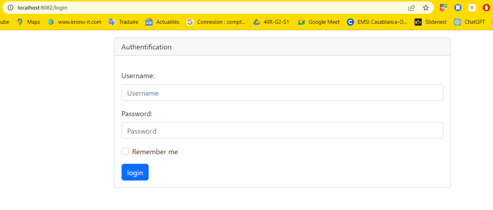
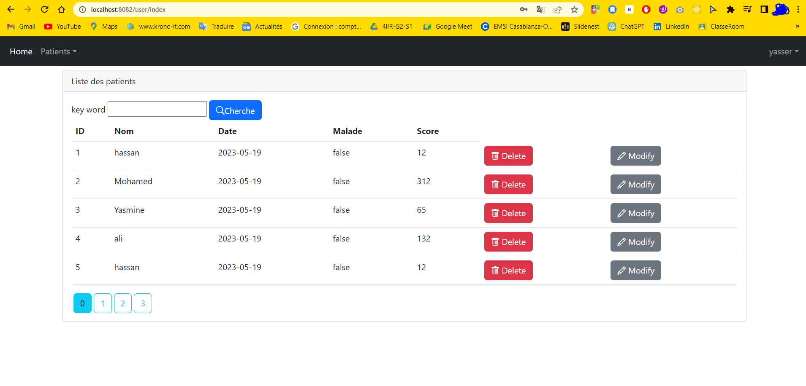

<h3>
Compte Rendu
</h3>

**************************************************************************************************************************************************************************

<h5><u>Introduction :</u></h5>
J'ai réalisé une application de gestion des patients en utilisant plusieurs technologies, notamment Spring Boot, Bootstrap, JPA Hibernate, Spring Data, Spring MVC, Spring 
Security et Thymeleaf. L'objectif principal de cette application était de fournir une plateforme conviviale permettant d'ajouter, supprimer, modifier et afficher les
informations des patients de manière efficace et sécurisée.

**************************************************************************************************************************************************************************

<h5><u>Architecture :</u></h5>
L'application suit une architecture MVC (Modèle-Vue-Contrôleur) afin de séparer les différentes responsabilités. Spring Boot a été utilisé comme framework principal pour
faciliter la configuration et le déploiement de l'application. J'ai également utilisé Spring MVC pour gérer les requêtes et les réponses HTTP, et Thymeleaf comme moteur 
de template pour générer les vues HTML.

**************************************************************************************************************************************************************************

<h5><u>Gestion des patients :</u></h5>
La gestion des patients a été mise en œuvre en utilisant JPA Hibernate pour la couche de persistance des données. J'ai créé une entité "Patient" comprenant des attributs
tels que nom, prénom, date de naissance, adresse, etc. J'ai utilisé les annotations de mapping de Hibernate pour définir les relations entre les entités, notamment la 
relation "One-to-Many" avec une entité "Rendez-vous".

**************************************************************************************************************************************************************************

<h5><u>Accès aux données :</u></h5>
Spring Data a été utilisé pour simplifier l'accès et la manipulation des données. J'ai créé des interfaces de repository qui étendent les fonctionnalités de base fournies
par Spring Data. Ces interfaces ont permis de définir des méthodes pour effectuer des opérations courantes telles que l'ajout, la suppression, la modification et l'affichage 
des patients. L'utilisation de Spring Data a considérablement réduit la quantité de code boilerplate nécessaire pour interagir avec la base de données.

**************************************************************************************************************************************************************************

<h5><u>Sécurité :</u></h5>
La sécurité de l'application a été assurée en intégrant Spring Security. J'ai configuré des rôles d'utilisateur tels que "ADMIN" et "USER" et j'ai restreint l'accès à
certaines fonctionnalités en fonction de ces rôles. Par exemple, seuls les utilisateurs ayant le rôle "ADMIN" peuvent effectuer des opérations de suppression ou de 
modification des patients. Spring Security a également permis de gérer l'authentification des utilisateurs pour garantir l'accès sécurisé à l'application.

**************************************************************************************************************************************************************************

<h5><u>Interface utilisateur :</u></h5>
J'ai utilisé Bootstrap pour créer une interface utilisateur réactive et esthétiquement agréable. J'ai conçu des formulaires de saisie pour permettre aux utilisateurs 
d'ajouter, de modifier et de supprimer les patients. J'ai également utilisé des tableaux pour afficher les patients existants avec des fonctionnalités de pagination et 
de recherche. Thymeleaf a été utilisé pour lier les données du modèle à la vue et générer dynamiquement les pages HTML.

**************************************************************************************************************************************************************************

<h5><u>Conclusion :</u></h5>
En utilisant Spring Boot, Bootstrap, JPA Hibernate, Spring Data, Spring MVC, Spring Security et Thymeleaf, j'ai réussi à développer une application de gestion des 
patients complète et fonctionnelle. L'architecture MVC a permis une séparation claire des responsabilités, tandis que l'utilisation de JPA Hibernate et Spring Data 
a simplifié la couche d'accès aux données. 

**************************************************************************************************************************************************************************

